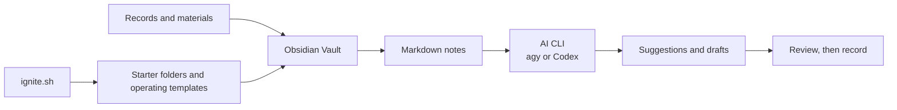

[한국어](README.md) | **English**

# Park-Dal-Wiki
> A starting point for an AI-assisted reference room, so your knowledge does not evaporate.


## Why Park-Dal-Wiki

Notes remain, but when they are needed, the search often starts from scratch. Park-Dal-Wiki makes an Obsidian folder a place where knowledge can accumulate, and provides a small starting kit for keeping the context you need when working with AI.

## Three starting points

- **Set the folders first.** — `ignite.sh` creates starter folders and operating templates for records, learning, and methods.
- **Keep records in Markdown.** — Notes written in Obsidian become material you can find and connect later.
- **Write with AI.** — agy and Codex CLI are optional tools. Review an AI suggestion before adding it to your records.

## Structure



The loop is: `record → context → work with AI → review, then record`.

## Components

| Area | Used | Status |
|---|---|---|
| Bootstrap script | Bash `ignite.sh` | Included in this repository |
| Operating rules | `AGENTS.md`, `templates/CLAUDE.md`, `templates/GEMINI.md` | Included in this repository |
| Writing space | Obsidian Vault | Installed in the course |
| Terminal | [Terminal plugin](https://github.com/polyipseity/obsidian-terminal) | Windows-course extension |
| Querying | Dataview plugin | Windows-course extension |
| AI CLI | [Antigravity CLI (agy)](https://antigravity.google/docs/cli-install?app=antigravity-ide) / [Codex CLI](https://learn.chatgpt.com/docs/codex/cli) | Optional installation |

## Get started

### 1. Get the repository

If Git is available, clone the repository. Otherwise, use **Code → Download ZIP** on GitHub and unzip it.

```powershell
git clone https://github.com/ljhljh0703-cmd/Park-Dal-Wiki.git
cd Park-Dal-Wiki
```

### 2. Open the folder in Obsidian

In Obsidian, select **Open folder as vault**, then choose the `Park-Dal-Wiki` folder you just downloaded.

### 3. Prepare the plugins

1. In **Settings → Community plugins**, turn off Restricted mode.
2. In **Browse**, find `Terminal` and choose **Install → Enable**.
3. In the same place, find `Dataview` and choose **Install → Enable**.
4. On Windows, run the line below to help PowerShell connect reliably.

```powershell
py -m pip install psutil pywinctl typing_extensions
```

The command palette is `Ctrl + P`. Select `Terminal: Open root directory in terminal: Integrated` to open a terminal inside Obsidian. The command and its result appear in that same window.

### 4. Install and run agy

Paste the following command into the Obsidian integrated terminal or Windows PowerShell.

```powershell
irm https://antigravity.google/cli/install.ps1 | iex
```

When the installation finishes, close and reopen the terminal, then run these commands in order.

```powershell
agy --version
agy
```

The `--` in `--version` is two keyboard hyphens, not an em dash. The first `agy` run may open a sign-in screen.

### 5. Add Codex CLI as well (optional)

Install [Node.js LTS](https://nodejs.org/) first, then open a new PowerShell window. Windows PowerShell can block `npm.ps1` or `codex.ps1` through its execution policy, so the course uses the `.cmd` form below.

```powershell
node --version
npm.cmd --version
npm.cmd install -g @openai/codex
codex.cmd
```

Choose a sign-in method on the first run. After installation, run `codex.cmd` from the folder where you want to work.

### 6. Create the starter folders

`ignite.sh` is a Bash script. On Windows, move to the repository folder in Git Bash or WSL, then run it.

```bash
bash ignite.sh
```

Enter your purpose in one sentence. The script creates `daily`, `learnings`, `methods`, `thoughts`, `graph`, and `docs`, plus two operating templates.

## Honest notes and limits

- This repository provides the starter script and operating templates. Obsidian, its plugins, agy, and Codex CLI are not included in the repository.
- The available scope of agy and Codex CLI depends on each service's account, plan, and connection environment.
- AI does not automatically make notes authoritative. Read and revise important records before saving them.
- `ignite.sh` is for Bash. It does not run in Windows PowerShell alone.

## Guide pages

[Quick guide screen](./index.html) · [Park Dal WIKI introduction page](./ParkDalWIKI.html)

## License

This repository currently has no `LICENSE` file. Ask the repository author before reusing, distributing, or modifying its contents.
