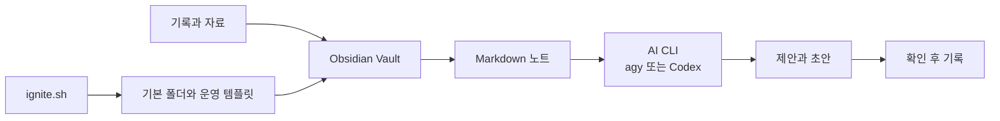

**한국어** | [English](README.en.md)

# Park-Dal-Wiki
> 내 지식이 휘발되지 않도록, AI와 함께 쓰는 자료실의 시작점.


## 왜 Park-Dal-Wiki인가

메모는 남는데, 막상 필요할 때는 어디에 적었는지부터 다시 찾게 됩니다. Park-Dal-Wiki는 Obsidian 폴더를 지식이 쌓이는 자리로 만들고, AI와 대화할 때 필요한 맥락을 그 안에 차곡차곡 남기기 위한 작은 시작 키트입니다.

## 세 가지로 시작합니다

- **폴더부터 정합니다.** — `ignite.sh`가 기록·학습·방법론을 위한 기본 폴더와 운영 템플릿을 만듭니다.
- **기록은 Markdown으로 남깁니다.** — Obsidian에서 쓴 노트가 나중에 다시 찾고 연결할 수 있는 자료가 됩니다.
- **AI와 함께 씁니다.** — agy 또는 Codex CLI는 선택 도구입니다. AI가 제안한 내용은 사람이 확인한 뒤 기록합니다.

## 구조



`기록 → 맥락 → AI와 작업 → 확인 후 기록`의 흐름입니다.

## 구성

| 구분 | 사용 | 상태 |
|---|---|---|
| 시작 스크립트 | Bash `ignite.sh` | 저장소 포함 |
| 운영 규칙 | `AGENTS.md`, `templates/CLAUDE.md`, `templates/GEMINI.md` | 저장소 포함 |
| 기록 공간 | Obsidian Vault | 수업에서 설치 |
| 터미널 | [Terminal 플러그인](https://github.com/polyipseity/obsidian-terminal) | Windows 수업용 확장 |
| 조회 | Dataview 플러그인 | Windows 수업용 확장 |
| AI CLI | [Antigravity CLI (agy)](https://antigravity.google/docs/cli-install?app=antigravity-ide) / [Codex CLI](https://learn.chatgpt.com/docs/codex/cli) | 선택 설치 |

## 시작하기

### 1. 저장소를 받습니다

Git을 쓸 수 있다면 아래처럼 받습니다. Git이 없다면 GitHub의 **Code → Download ZIP**으로 내려받아 압축을 풀어도 됩니다.

```powershell
git clone https://github.com/ljhljh0703-cmd/Park-Dal-Wiki.git
cd Park-Dal-Wiki
```

### 2. Obsidian에서 폴더를 엽니다

Obsidian에서 **Open folder as vault**를 누르고, 방금 받은 `Park-Dal-Wiki` 폴더를 선택합니다.

### 3. 플러그인을 준비합니다

1. **Settings → Community plugins**에서 Restricted mode를 끕니다.
2. **Browse**에서 `Terminal`을 찾아 **Install → Enable** 합니다.
3. 같은 곳에서 `Dataview`를 찾아 **Install → Enable** 합니다.
4. Windows에서는 PowerShell을 안정적으로 연결하기 위해 아래 한 줄을 실행합니다.

```powershell
py -m pip install psutil pywinctl typing_extensions
```

명령 팔레트는 `Ctrl + P`입니다. `터미널: 루트 디렉토리에서 터미널 open: 통합`을 선택하면 Obsidian 안에서 터미널을 열 수 있습니다. 명령을 입력한 창에서 결과도 바로 확인합니다.

### 4. agy를 설치하고 실행합니다

Obsidian 통합 터미널 또는 Windows PowerShell에 아래 명령을 붙여넣습니다.

```powershell
irm https://antigravity.google/cli/install.ps1 | iex
```

설치가 끝나면 터미널을 닫았다가 다시 열고, 다음을 차례로 실행합니다.

```powershell
agy --version
agy
```

`--version`의 `--`는 긴 대시가 아니라 키보드의 `-`를 두 번 누른 것입니다. `agy`를 처음 실행하면 로그인 화면이 열릴 수 있습니다.

### 5. Codex CLI도 쓰고 싶다면 (선택)

먼저 [Node.js LTS](https://nodejs.org/)를 설치하고, PowerShell을 새로 엽니다. Windows PowerShell에서 실행 정책 때문에 `npm.ps1` 또는 `codex.ps1`이 막히는 경우가 있어, 아래처럼 `.cmd` 명령을 사용합니다.

```powershell
node --version
npm.cmd --version
npm.cmd install -g @openai/codex
codex.cmd
```

첫 실행에서 로그인 방법을 선택합니다. 설치가 끝난 뒤에는 원하는 작업 폴더에서 `codex.cmd`를 실행하면 됩니다.

### 6. 기본 폴더를 만듭니다

`ignite.sh`는 Bash 스크립트입니다. Windows에서는 Git Bash 또는 WSL에서 저장소 폴더로 이동한 뒤 실행합니다.

```bash
bash ignite.sh
```

목적을 한 줄로 입력하면 `daily`, `learnings`, `methods`, `thoughts`, `graph`, `docs` 폴더와 두 운영 템플릿이 만들어집니다.

## 정직한 안내

- 이 저장소는 시작 스크립트와 운영 템플릿을 제공합니다. Obsidian, 플러그인, agy, Codex CLI는 저장소에 포함되어 있지 않습니다.
- agy와 Codex CLI는 각 서비스의 계정·요금제·접속 환경에 따라 사용할 수 있는 범위가 달라집니다.
- AI가 노트를 자동으로 정답으로 확정하지 않습니다. 중요한 기록은 내용을 읽고 고친 뒤 저장하세요.
- `ignite.sh`는 Bash용입니다. Windows PowerShell만으로는 실행되지 않습니다.

## 안내 페이지

[간단 안내 화면](./index.html) · [Park Dal WIKI 소개 페이지](./ParkDalWIKI.html)

## License

현재 이 저장소에는 `LICENSE` 파일이 없습니다. 재사용·배포·수정 권한은 저장소 작성자에게 확인한 뒤 진행하세요.
